# Turbo-Task — DevSecOps GitOps Deployment on AWS EKS

A MERN (MongoDB Atlas, Express, React, Node.js) task management application deployed using **DevSecOps + GitOps** workflow on **AWS EKS (v1.34)** in region **`ap-south-1` (Mumbai)**. Infrastructure is provisioned via **Terraform**, automated security scanning and container builds are managed by **Jenkins**, continuous delivery is driven by **ArgoCD**, and in-cluster observability is handled by **Prometheus & Grafana**.


---

## Table of Contents
- [Overview](#overview)
- [Tech Stack](#tech-stack)
- [Architecture Diagram](#architecture-diagram)
- [CI/CD Pipeline Diagram](#cicd-pipeline-diagram)
- [Security Highlights](#security-highlights)
- [Repository Structure](#repository-structure)
- [Prerequisites](#prerequisites)
- [Setup & Deployment](#setup--deployment)
  - [1. Provision AWS Infrastructure](#1-provision-aws-infrastructure)
  - [2. Configure Jenkins and Security Tools](#2-configure-jenkins-and-security-tools)
  - [3. Configure Jenkins Pipeline](#3-configure-jenkins-pipeline)
  - [4. Configure EKS and Kubernetes](#4-configure-eks-and-kubernetes)
  - [5. Configure ArgoCD](#5-configure-argocd)
  - [6. Configure Monitoring Stack](#6-configure-monitoring-stack)
  - [7. Verify Deployment](#7-verify-deployment)
- [Screenshots](#screenshots)
- [Cleanup](#cleanup)

---

## Overview

Turbo-Task implements a **"Git as the single source of truth"** DevSecOps workflow:

- **Infrastructure as Code**: AWS VPC, EKS cluster, ECR registries, IAM roles, and Jenkins EC2 are fully defined using Terraform in `ap-south-1`.
- **Decoupled Repositories**: The application source code ([`TurboTask`](https://github.com/mystic1121/TurboTask.git)) and Kubernetes deployment manifests (`devsecops-eks-pipeline`) are maintained in separate GitHub repositories.
- **GitOps Continuous Delivery**: Jenkins never directly applies manifests to EKS. After building and scanning container images, Jenkins updates image tags in the GitOps repository. **ArgoCD** continuously monitors Git and reconciles cluster state automatically.

---

## Tech Stack

| Layer | Technology |
|---|---|
| **Cloud Provider** | AWS (`ap-south-1` Mumbai) |
| **Infrastructure as Code** | Terraform (`aws` provider `~> 5.0`) |
| **Container Registry** | Amazon ECR (`turbo-task-frontend`, `turbo-task-backend`) |
| **CI / Security Server** | Jenkins |
| **SAST Code Analysis** | SonarQube Community Edition (Quality Gate enforced) |
| **Vulnerability Scanner** | Trivy (Filesystem + Container Image scanning, CI-blocking on Criticals) |
| **Containerization** | Docker |
| **Orchestration** | AWS EKS (Kubernetes v1.34) |
| **GitOps CD** | ArgoCD |
| **Database** | MongoDB Atlas (Cloud Managed Cluster) |
| **Observability** | `kube-prometheus-stack` (Prometheus Server, Grafana, Node Exporter, `kube-state-metrics`) |

---

## Architecture Diagram


---

## CI/CD Pipeline Diagram

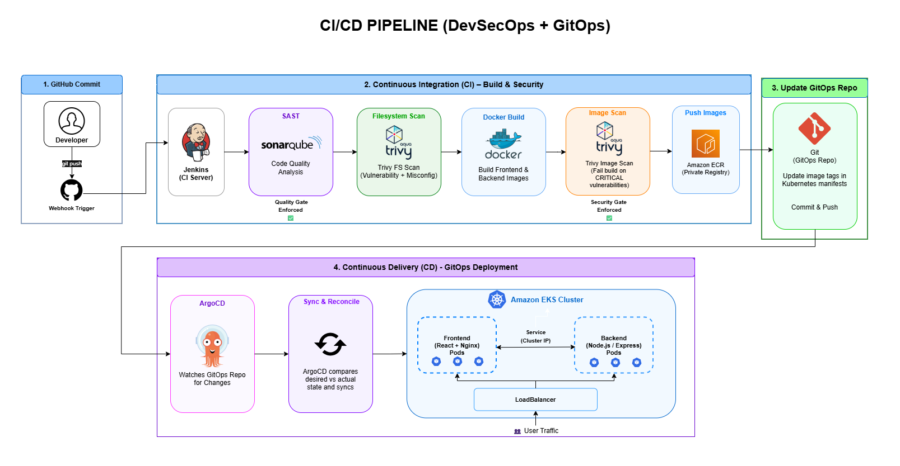

---

## Security Highlights

- **IAM Instance Profile Auth**: Jenkins authenticates to Amazon ECR via an attached EC2 IAM Role. No static AWS access keys (`AWS_ACCESS_KEY_ID`) are stored on the CI server.
- **Zero Plaintext Secrets in Git**: Sensitive database credentials (`MONGODB_URI`) are injected directly into EKS via `kubectl create secret`.
- **Active CI Security Gates**: Builds are automatically halted if SonarQube Quality Gate fails (`waitForQualityGate`) or if Trivy detects `CRITICAL` vulnerabilities in container images (`--exit-code 1 --severity CRITICAL`).
- **IP-Restricted Ingress**: Security groups restrict SSH (22), Jenkins (8080), and SonarQube (9000) access strictly to the administrator's public IP address (`var.admin_ip`).
- **Isolated Backend Microservice**: The backend Node.js API is deployed as an internal `ClusterIP` service, accessible only via Nginx reverse proxy from frontend pods.

---

## Repository Structure

```text
devsecops-eks-pipeline/
├── argocd/
│   └── application.yaml                # ArgoCD Application CRD manifest
├── docs/
│   ├── Screenshots/                    # Real deployment screenshots
│   │   ├── Jenkins-Cicd-StageView(1).png
│   │   ├── SonarQube-QualityGate(2).png
│   │   ├── Trivy-backend-scan(3-a).png
│   │   ├── Trivy-frontend-scan(3-b).png
│   │   ├── Frontend-ECR(4-a).png
│   │   ├── Backend-ECR(4-b).png
│   │   ├── GitOps-Automated-Commit(5).png
│   │   ├── ArgoCD-Status(6).png
│   │   ├── k8s-cluster-state(7).png
│   │   ├── Grafana-Dashboard(8).png
│   │   └── Website.png
│   ├── Architecture Diagram.png        # Architecture diagram graphic
│   └── cicd-pipeline.png               # DevSecOps CI/CD workflow graphic
├── k8s/
│   ├── namespace.yaml                  # 'turbo' namespace manifest
│   ├── mongo-secret.yaml               # Database secret template
│   ├── backend-deployment.yaml         # Node.js backend API Deployment
│   ├── backend-service.yaml            # Backend ClusterIP Service (Port 4000)
│   ├── frontend-deployment.yaml        # React SPA + Nginx Deployment
│   └── frontend-service.yaml           # Frontend LoadBalancer Service (Port 80)
├── terraform/
│   ├── provider.tf                     # Terraform & AWS provider config
│   ├── variables.tf                    # AWS region (ap-south-1) & admin_ip
│   ├── vpc.tf                          # AWS VPC, subnets, NAT Gateway
│   ├── ecr.tf                          # ECR frontend & backend repos
│   ├── iam_jenkins.tf                  # Least-privilege IAM profile for ECR
│   ├── ec2_jenkins.tf                  # Security Group & Jenkins EC2 instance
│   ├── eks.tf                          # AWS EKS Cluster (v1.34) & Node Group
│   └── outputs.tf                      # Outputs for EC2 IP, ECR URLs, EKS name
├── Jenkins-pipeline.txt                # Declarative Jenkinsfile reference
└── Setup-Script.sh                     # EC2 automated setup script for Jenkins/Docker/Trivy
```

---

## Prerequisites

Before beginning deployment, ensure you have:
- An active **AWS Account** with permissions for VPC, EC2, IAM, EKS, and ECR in `ap-south-1`.
- **AWS CLI v2**, **Terraform (v1.5+)**, **kubectl**, and **Helm** installed on your local machine.
- Two GitHub Repositories:
  - `TurboTask` (Application code & `Jenkinsfile`)
  - `devsecops-eks-pipeline` (Kubernetes manifests)
- A **MongoDB Atlas** cluster and connection string.
- Your public IP address (`curl -4 -s ifconfig.me`) for Terraform security group restrictions.

---

## Setup & Deployment

### 1. Provision AWS Infrastructure

Use Terraform to provision all required cloud resources in AWS region `ap-south-1` (Mumbai).

```bash
cd terraform
terraform init
terraform plan -var="admin_ip=$(curl -4 -s ifconfig.me)/32"
terraform apply -var="admin_ip=$(curl -4 -s ifconfig.me)/32" --auto-approve
```

**Provisioned Components:**
- **VPC (`10.0.0.0/16`)**: Public and private subnets across two AZs (`ap-south-1a`, `ap-south-1b`), Internet Gateway, and a single NAT Gateway.
- **Jenkins EC2**: Ubuntu 22.04 LTS instance (`t3.large`) with attached IAM Instance Profile.
- **Amazon ECR Repositories**: `turbo-task-frontend` and `turbo-task-backend`.
- **Amazon EKS Cluster**: EKS v1.34 cluster with managed node group (`t3.medium` instances).

---

### 2. Configure Jenkins and Security Tools

1. **SSH into Jenkins EC2 Server**:
   ```bash
   ssh -i /path/to/your-key.pem ubuntu@<JENKINS_PUBLIC_IP>
   ```

2. **Automated Environment Setup (`Setup-Script.sh`)**:
   Run the provided [`Setup-Script.sh`](Setup-Script.sh) to automatically install Docker, OpenJDK 17, Jenkins, Trivy scanner, and AWS CLI v2, as well as configure proper group permissions for `jenkins` and `ubuntu` users:
   ```bash
   chmod +x Setup-Script.sh
   ./Setup-Script.sh
   ```

3. **Launch SonarQube Container**:
   ```bash
   docker run -d --name sonar -p 9000:9000 --restart always sonarqube:lts-community
   ```

4. **Configure SonarQube Token & Webhook**:
   - Access SonarQube UI at `http://<JENKINS_PUBLIC_IP>:9000` (default login: `admin`/`admin`).
   - Generate a User Token (`sonar-token`).
   - Create a Webhook pointing to `http://<JENKINS_PRIVATE_IP>:8080/sonarqube-webhook/`.

---

### 3. Configure Jenkins Pipeline

1. **Install Jenkins Plugins**:
   Install *SonarQube Scanner*, *Eclipse Temurin Installer*, *NodeJS Plugin*, *Docker Pipeline*, and *Git*.

2. **Add Credentials in Jenkins**:
   - `sonar-token`: Secret text (SonarQube Token).
   - `github-credentials`: Username & PAT for GitOps repository commits.

3. **Configure Global Tools & System Settings**:
   - Configure JDK (`jdk17`), NodeJS (`node18`), and SonarQube Scanner (`sonar-scanner`).
   - Add SonarQube Server URL (`http://localhost:9000`) linked to `sonar-token`.

4. **Pipeline Workflow (`Jenkinsfile`)**:
   - **Checkout**: Pulls latest commit from `turbo-task-app`.
   - **SonarQube SAST**: Scans code and enforces `waitForQualityGate(abortPipeline: true)`.
   - **Trivy FS Scan**: Scans repository for misconfigurations and vulnerabilities.
   - **Docker Build**: Builds frontend and backend container images.
   - **Trivy Image Scan**: Scans images with `--exit-code 1 --severity CRITICAL` to block vulnerable deployments.
   - **ECR Push**: Authenticates via EC2 IAM Instance Profile and pushes versioned tags to ECR.
   - **GitOps Update**: Updates deployment tags in `turbo-task-gitops` and pushes to GitHub.

---

### 4. Configure EKS and Kubernetes

1. **Update local `kubeconfig` to connect to EKS**:
   ```bash
   aws eks update-kubeconfig --region ap-south-1 --name turbo-task-eks
   ```

2. **Create Application Namespace**:
   ```bash
   kubectl apply -f k8s/namespace.yaml
   ```

3. **Create Database Secret**:
   Create the `mongo-secret` manually in the `turbo` namespace (do NOT commit real credentials to Git):
   ```bash
   kubectl create secret generic mongo-secret \
     --from-literal=MONGODB_URI="<YOUR_MONGODB_ATLAS_CONNECTION_STRING>" \
     -n turbo
   ```

---

### 5. Configure ArgoCD

1. **Install ArgoCD Controller in EKS**:
   ```bash
   kubectl create namespace argocd
   kubectl apply -n argocd -f https://raw.githubusercontent.com/argoproj/argo-cd/stable/manifests/install.yaml
   ```

2. **Deploy ArgoCD Application Manifest**:
   Apply [`argocd/application.yaml`](argocd/application.yaml) to connect ArgoCD to the `devsecops-eks-pipeline` repository:
   ```bash
   kubectl apply -f argocd/application.yaml
   ```

3. **Automated Sync**:
   ArgoCD continuously monitors `devsecops-eks-pipeline/k8s/` and automatically syncs changes to EKS in the `turbo` namespace.

---

### 6. Configure Monitoring Stack

1. **Install `kube-prometheus-stack` via Helm**:
   ```bash
   helm repo add prometheus-community https://prometheus-community.github.io/helm-charts
   helm repo update
   helm install kube-prometheus-stack prometheus-community/kube-prometheus-stack \
     -n monitoring --create-namespace
   ```

2. **Observability Features**:
   - **Prometheus**: Automatically scrapes pod metrics (`/metrics`), `kube-state-metrics`, and host `Node Exporter` endpoints.
   - **Grafana**: Visualizes cluster health, CPU/Memory consumption, and pod status.

3. **Access Grafana Dashboard**:
   ```bash
   kubectl port-forward svc/kube-prometheus-stack-grafana 3000:80 -n monitoring
   ```
   Open `http://localhost:3000` (default user: `admin`, retrieve password via `kubectl get secret`).

---

### 7. Verify Deployment

- **Frontend Service**: Exposed via AWS LoadBalancer (`turbo-frontend-service` on port 80).
- **Nginx Reverse Proxy**: Frontend pods proxy incoming `/api/` traffic directly to `turbo-backend-service:4000` (ClusterIP).
- **Backend Service**: Internal Node.js Express API connected securely to MongoDB Atlas over TLS through the NAT Gateway.

Refer to the [Screenshots](#screenshots) section below for step-by-step visual verification of all pipeline stages, security gates, ArgoCD sync, and Grafana dashboards.

---

## Screenshots

### 1. Jenkins CI/CD Pipeline
Jenkins executes the full declarative CI/CD pipeline with all stages passed successfully:

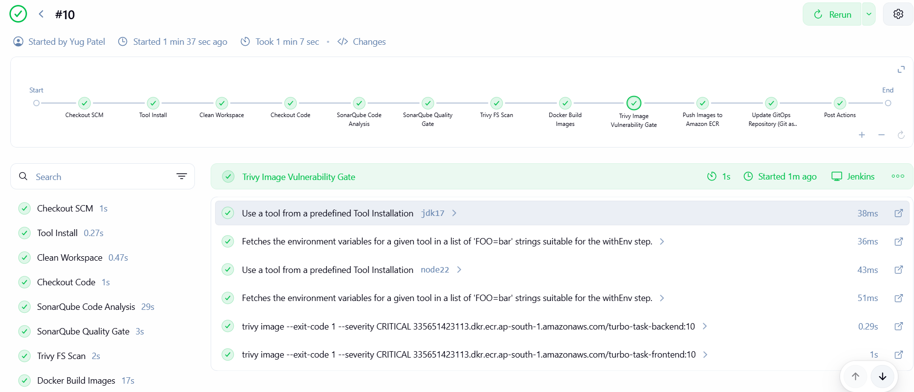

---

### 2. SonarQube Quality Gate
SonarQube performs static code analysis and the pipeline enforces the Quality Gate.

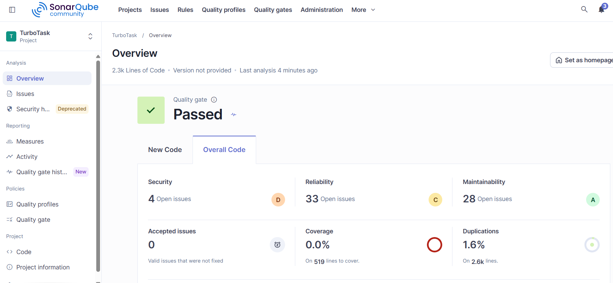

---

### 3. Trivy Security Scans
Trivy vulnerability scanning output for frontend and backend container images:

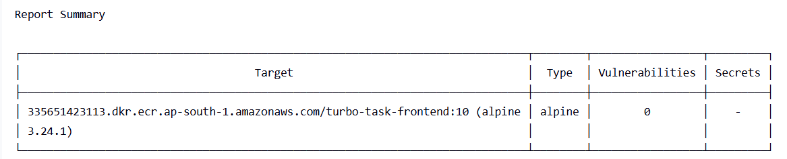

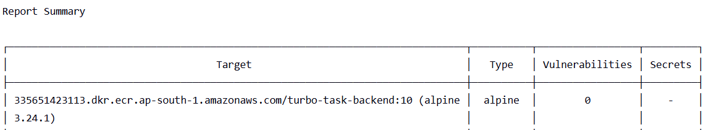

---

### 4. Amazon ECR Repositories
Versioned Docker container images pushed to Amazon ECR repositories (`turbo-task-frontend` & `turbo-task-backend`):

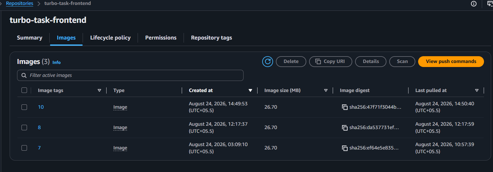

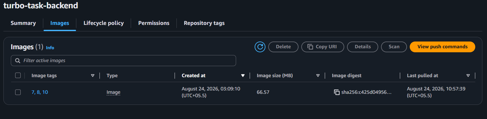

---

### 5. GitOps Automated Commits
Automated commits from Jenkins pipeline updating deployment tags in `devsecops-eks-pipeline`:

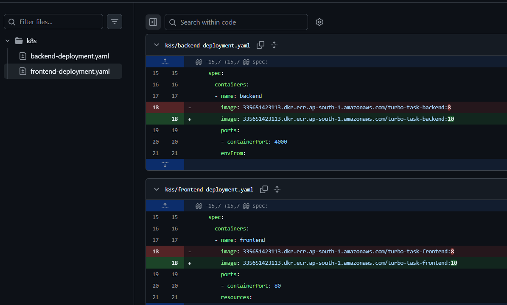

---

### 6. ArgoCD GitOps Status
ArgoCD UI showing `Healthy` and `Synced` deployment state across EKS workloads:

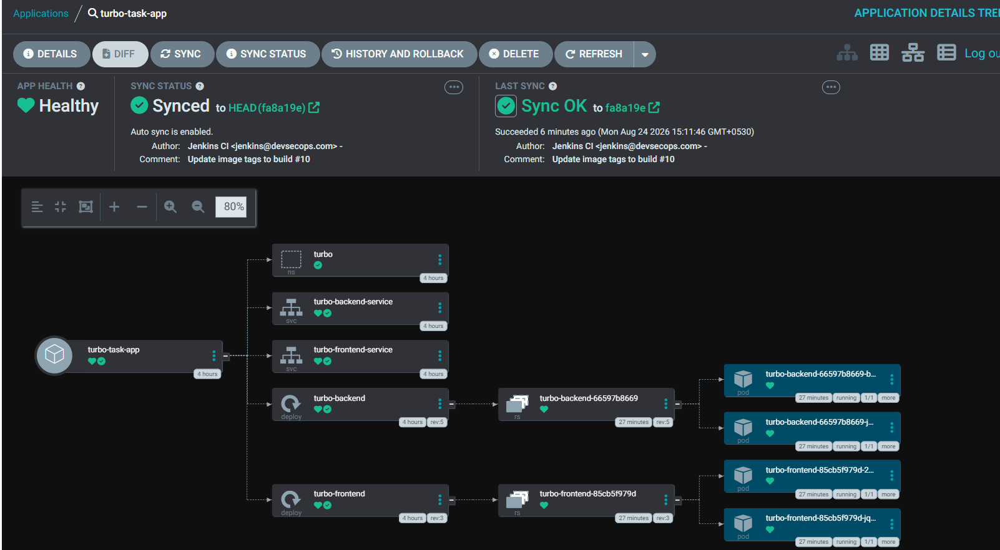

---

### 7. Kubernetes Cluster Workloads
Cluster pod state (`kubectl get pods -n turbo`) showing active running replicas:

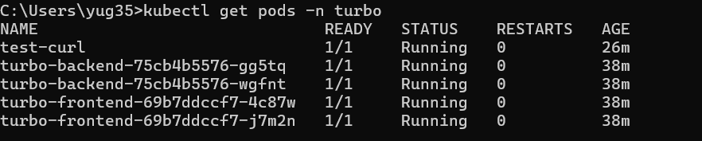

---

### 8. Grafana Observability Dashboard
Live Grafana dashboard rendering EKS cluster CPU, Memory, and Node metrics:

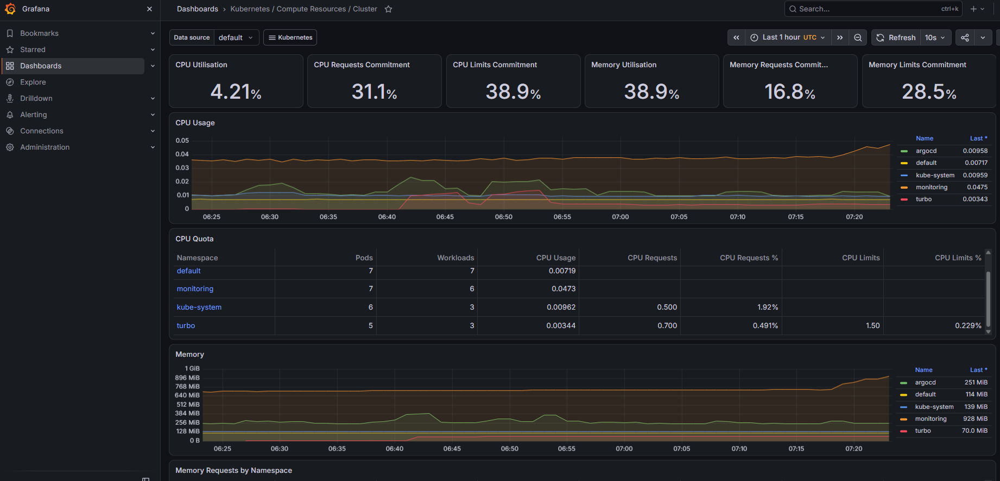

---

### 9. Live Application
Live React web application running in production via AWS LoadBalancer:

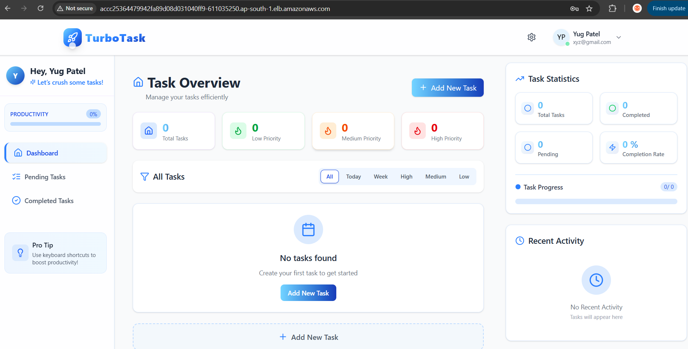

---

## Cleanup

To avoid incurring cloud infrastructure costs on AWS, destroy all resources when finished:

1. **Delete ArgoCD Application & Workloads**:
   ```bash
   kubectl delete -f argocd/application.yaml
   ```

2. **Destroy AWS Infrastructure via Terraform**:
   ```bash
   cd terraform
   terraform destroy -var="admin_ip=$(curl -4 -s ifconfig.me)/32" --auto-approve
   ```
